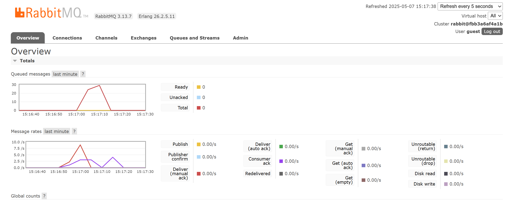
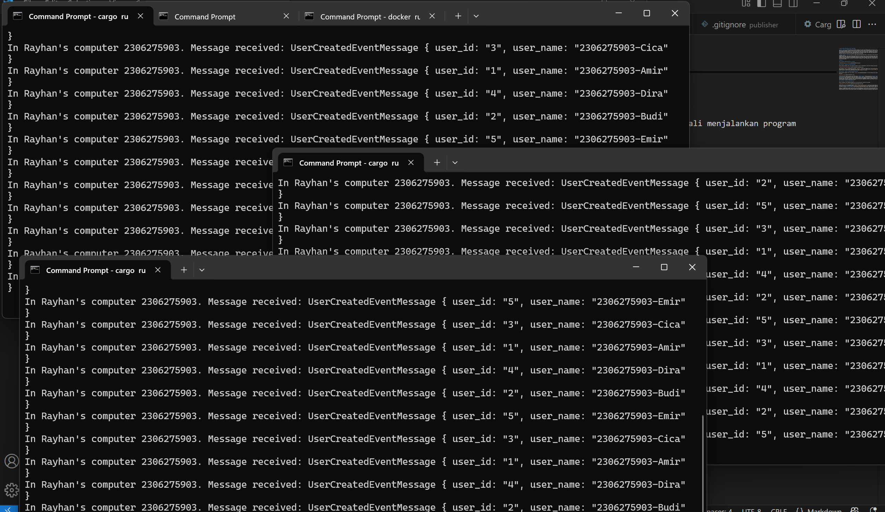

# Tutorial Modul Pemrograman Lanjut (2024/2025)

 
a. What is AMQP?

AMQP (Advanced Message Queuing Protocol) adalah protokol open standard berbasis wire-level yang digunakan untuk komunikasi message-oriented middleware. AMQP memungkinkan sistem yang berbeda untuk saling bertukar pesan secara andal, aman, dan terstruktur melalui message broker seperti RabbitMQ. Dengan AMQP, kita bisa membangun sistem terdistribusi yang loosely-coupled, di mana produsen dan konsumen pesan tidak perlu saling mengetahui secara langsung satu sama lain. Hal ini sangat mendukung pola arsitektur Event-Driven karena komunikasi dilakukan melalui event yang dikirim sebagai pesan ke message broker.

 
 
b. Apa arti dari guest:guest@localhost:5672?

guest:guest@localhost:5672 adalah URI (Uniform Resource Identifier) untuk koneksi ke server RabbitMQ menggunakan protokol AMQP. Kata pertama guest adalah username, dan guest kedua adalah password. Bagian localhost menunjukkan bahwa RabbitMQ dijalankan secara lokal di komputer pengguna, dan 5672 adalah port default yang digunakan RabbitMQ untuk komunikasi AMQP. Jadi, string ini artinya kita mencoba mengakses broker RabbitMQ yang berjalan di komputer lokal, menggunakan kredensial default guest untuk otentikasi.

### Screenshot - Multiple Subscribers Handling Events

Berikut tangkapan layar dari RabbitMQ Management UI dan tiga konsol yang menjalankan subscriber secara bersamaan:

Dalam eksperimen ini, kami menjalankan tiga konsol subscriber secara bersamaan, masing-masing mengakses queue yang sama. Hal ini memungkinkan pemrosesan pesan menjadi lebih cepat karena beban pemrosesan dibagi di antara tiga konsumen. Sebelumnya, dengan hanya satu subscriber, antrian pesan meningkat pesat, namun dengan menambahkan lebih banyak subscriber, antrian pesan berkurang lebih cepat.

Pada pengujian ini, setiap subscriber memproses beberapa pesan. Misalnya, satu subscriber memproses pesan dari "Budi" dan "Dira", sementara subscriber lainnya memproses pesan "Amir", "Cica", dan "Emir". Ini memperlihatkan bagaimana horizontal scaling pada konsumen dapat mengurangi beban pemrosesan dan membuat sistem lebih responsif, terutama saat volume pesan tinggi.

Peningkatan yang bisa dilakukan di kode adalah memastikan bahwa sistem mampu menangani skala lebih besar, dengan memastikan lebih banyak subscriber yang bisa diproduksi dan juga memastikan pengiriman pesan tidak terlalu dibatasi oleh satu instance saja. Penggunaan mekanisme seperti backpressure dan load balancing dapat lebih membantu dalam skenario nyata.
